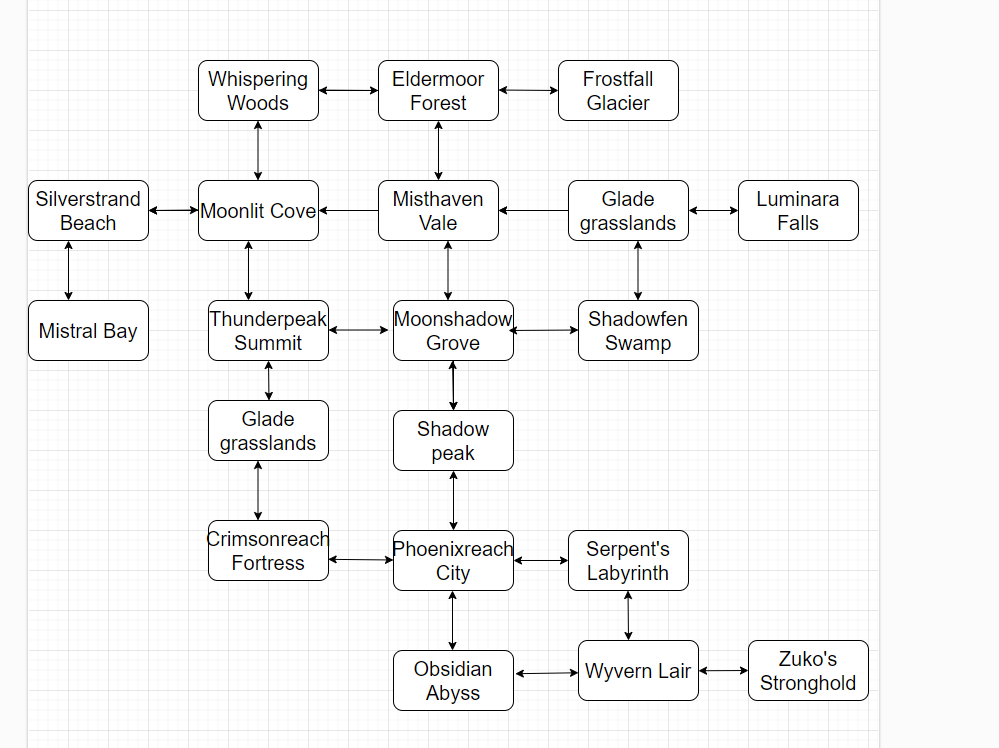
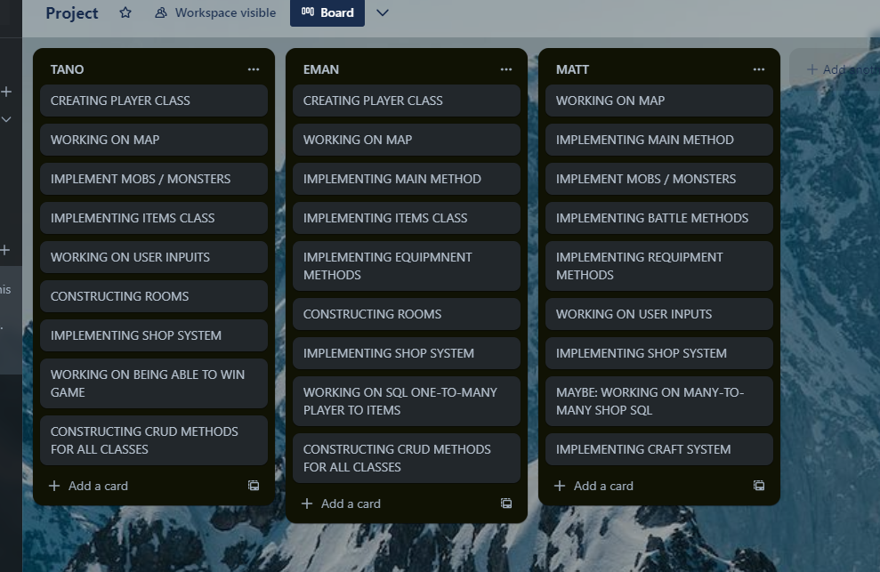

# Phase 3 Group Project

## Title: The Legend of Mattanoman

CLI adventure that game follows a story line of a fallen king that scales through the landscapes and towns, battling various creatures, monsters and foes. Eventually, defeating the black dragon and re-claiming their throne and kingdom.

## CRUD

- Create weapons by collecting wood and metal
- Read user information including health and current inventory
- Update inventory
- Delete items from inventory and delete monsters from the map

## User Stories

- user is able to decide their name:
  - user is able to view information about themselves
  - user is able to view information about equipment
  - user is able to view information about inventory:
    - user is able to carry multiple items
    - user is able to equip items
    - user is able to unequip items
- user is able to move to different locations:
  - user is able to view information about the location
  - user is able to pick up items from location
  - user is able to interact with shops:
    - user is able to buy items
    - user is able to sell items
- user is able to battle monsters:
  - user is able to die in battle
  - user is able to attack
  - user is able to win battle:
    - user is able to receive drops from the defeated monster
- user is able to beat the game:
  - user is able to defeat the dragon

